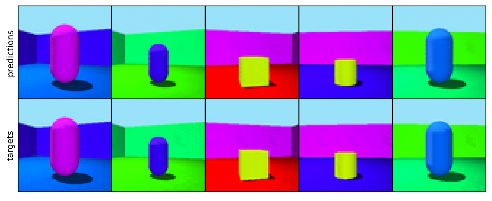
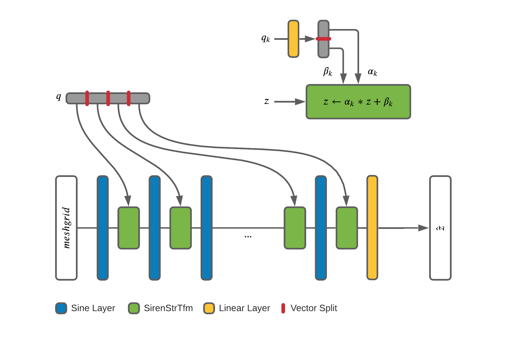
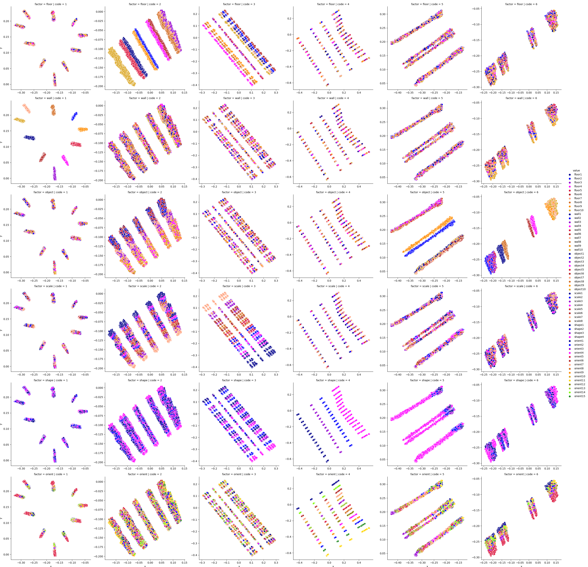

Structural Siren
================

Introduction
------------
Structural Siren Autoencoders (`SSAE`) strive to reveal factors of
variation in generative processes by structural disentanglement with Siren
networks.
Unlike VAEs, which achieve regularity on the latent space by enforcing
prior distributions on its latent codes,
`SSAE`s embed a hierarchical structural causal model (SCM) into their decoder:

.. math::

    S_i := f_i(PA_i, U_i), \ \ \ (i=1, ..., n)

Leeb et. al allude to the fact that in an SCM the endogenous variables
:math:`S_i` are not statistically independent but hierarchically dependent.
Instead, the set of noises :math:`U_i`, which are represented by the latent
codes of the `SSAE`, is assumed to be jointly independent. To emulate this
structure, the
latent codes are injected one after another into layers of the decoder.

Structural Causal Model
-----------------------
The SCM of `SSAE` has the following form:

.. math::

    h_1 = \alpha_1 * sin(w_1 * h_0 + b_1) + \beta_1

    h_2 = \alpha_2 * sin(w_2 * h_1 + b_2) + \beta_2

    ...

    h_K = \alpha_K * sin(w_K * h_{K-1} + b_K) + \beta_K

where :math:`\alpha_k` and :math:`\beta_k` originating from latent code
:math:`q_k` are subsequently injected into the decoder and modulate its
activations.

The advantage of using sinusoidal nonlinearities is to preserve second
and higher-order derivatives during reconstruction, compared to e.g. ReLU.

Experiment
----------

* data: 3dshapes_
* 70-10-20 train-dev-test split
* encoder: pre-trained `EfficientNet`_ "b0"
* decoder: 6-layer Siren with 6 :math:`q_k \in \!R²`

.. _3dshapes: https://github.com/deepmind/3d-shapes
.. _EfficientNet: https://github.com/lukemelas/EfficientNet-PyTorch

Visual Probing
--------------

The latent codes of the test set are visually probed for their disentanglement
by coloring them dependent on the configuration of the ground truth factors
of variation.

Installation
------------

To install `structsiren`, run:

.. code-block:: python

    pip install -r requirements.txt

Scripts
-------

1. `3dshapes_prepare_data.py`: prepare `3d-shapes` data
2. `3dshapes_train.py`: train Structural Siren with pre-trained `EfficientNet`
   encoder
3. `3dshapes_plot_shapes.py`: plot reconstructions for test data with
   pre-trained model
4. `3dshapes_collect_factors.py`: collect codes for train-dev-test data with
   pre-trained model
5. `3dshapes_measure_disentanglement.py`
6. `3dshapes_codes_to_factors.py`: create scatter plots of codes and colorize
   with manifestations of different ground truth factors
